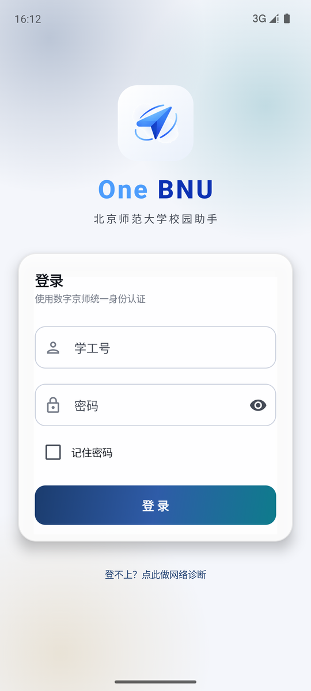
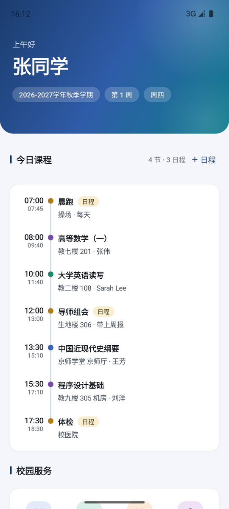
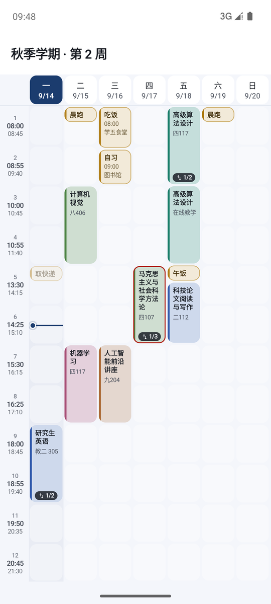
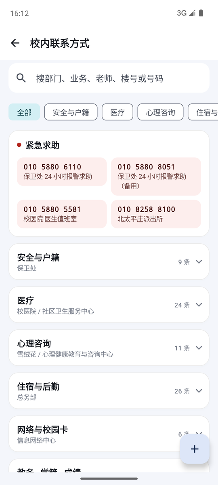

# One BNU

北京师范大学非官方校园助手，Android 应用。登录时可选择北京校区或珠海校区，分别访问对应的统一认证、教务与校园服务；
没有中间服务器，账号和数据只留在本机。

[](https://github.com/Joy-Reverie/One-BNU/releases/latest)
[](https://github.com/Joy-Reverie/One-BNU/actions/workflows/ci.yml)
[](LICENSE)


> 个人开发，与北京师范大学官方无关。使用者需对自己账号的使用行为负责。

## 功能

- **课表**：周视图、课程详情、多学期切换、双指缩放行高；左右滑动或点周次切周，离开本周时顶栏给一个「今」按钮；表头标注日期，当天整列高亮
- **今日课表桌面小组件**：2×2 / 4×2 / 4×3 / 4×4 四种尺寸，跟随应用内的深浅色与色系，后台按需刷新
- **成绩与 GPA**：官方 / 4.0 / 4.3 等多种绩点口径换算，按学期统计；缓考（即使暂记为 0 分）自动不计入，可手动勾选计算范围
- **考试安排**：含倒计时
- **空闲教室**：按周次或具体日期查询北京、珠海校区各楼空闲教室
- **校历与周次**：内置官方校历原图，可放大、保存到相册；两校区通用周次 — 日期对照与假期要点
- **校园平面图**与楼宇索引
- **学籍信息**：原生展示，身份证号等敏感字段不显示
- **培养方案**：北京校区学校课程中心入口，集中查看培养方案、教学手册与教学大纲
- **学分核算**：各学期修读学分按模块归类求和，归类可手动修改
- **缓存优先**：首次联网后按校区缓存学期、课表、成绩、考试、学籍、教室索引、培养方案模块与学分要求。之后进任何页面都**先显示本地快照**（「这一轮没有考试」这种空结果同样算快照），再在后台向教务要新数据；取到就静默替换，取不到就保留一行「为本地缓存，可能需要校园网更新」。流量、校外网络与无网下都不再卡在加载中
- **校内联系方式**：北京校区各部门公开办公电话；校区切换后与珠海功能隔离
- **个人日程**：事件、时间、地点、备注，可按星期几重复；与课表一起出现在首页时间轴、课表网格和小组件里，网格中按起止时刻定位、按时长取高
- **上课提醒 / 日程提醒**：两类各自开关、共用一个提前时间，开始前 N 分钟提醒（临时加的近期日程立刻提醒），可选通知提醒（响一声）或闹钟提醒（按闹钟音量持续响铃、锁屏全屏弹出，勿扰模式下只震动）
- **内嵌浏览器**：北京、珠海图书馆及各自门户、教务系统与课程中心；站内页面可直接打开，也可转系统浏览器
- **检查更新**：设置页内查询 GitHub Releases，下载并安装新版本；联网启动时自动检查一次并询问，可关闭
- **作息时间**：默认学校统一作息，可在设置里逐节调整上下课时刻；课表刻度、日程定位、提醒与小组件都按它算
- **深浅色与色系**：跟随系统或固定为浅色 / 深色；七套色系（靛蓝、青碧、松绿、珊瑚、琥珀、蔷薇、石墨）覆盖按钮、文字与桌面小组件。外观是应用级偏好，切换校区不会被重置
- **启动公告**：重要提示在启动时弹一次，按公告本身的发布日期记已读（同一份公告不会因为升级而重复打断）；历史公告在「我的 → 公告」里随时可查

## 截图

<table>
  <tr>
    <td></td>
    <td></td>
    <td></td>
    <td></td>
  </tr>
  <tr align="center">
    <td>登录</td><td>首页</td><td>课表</td><td>校内联系方式</td>
  </tr>
</table>

## 下载安装

在 [Releases](https://github.com/Joy-Reverie/One-BNU/releases/latest) 下载 `One-BNU-<版本>.apk` 安装，需要 Android 8.0 及以上。
每个版本附带 `.sha256` 校验文件：

```bash
shasum -a 256 -c One-BNU-<版本>.apk.sha256
```

之后的版本可以在应用内「我的 → 设置 → 版本 → 检查更新」直接下载安装。

所有发布包由同一把密钥签名，证书 SHA-256：

```
6E:DB:A4:54:AC:9D:F9:30:9C:BB:B3:0E:64:81:E0:0B:80:6A:50:E9:1B:9E:E3:08:0A:1B:95:F5:98:9D:CD:D7
```

可用 `apksigner verify --print-certs One-BNU-<版本>.apk` 核对。

## 隐私与安全

- 不设服务器。所有请求直接发往学校域名，只有「检查更新」（手动，或联网启动时自动，可在设置里关闭）会访问 GitHub 的公开接口，请求不带任何身份信息。
- 勾选“记住密码（下次自动登录）”后，账号密码经 `EncryptedSharedPreferences`（AES256-GCM，密钥由 Android Keystore 持有且不可导出）加密后仅存本机；
  Keystore 不可用时拒绝保存，而不是降级为明文。
- 会话 Cookie 只在内存，退出应用即失效。唯一跨会话留存的是认证服务用来认设备的 `devInfo`，它不是凭据，
  可在「网络诊断」里重置。登录表单中的设备标识是安装时生成的随机值，不采集硬件信息。
- 课表、成绩、考试、学籍、教室索引、培养方案模块与学分要求缓存存在按校区隔离的应用私有目录，退出登录即清除；学籍缓存只保留已脱敏的展示字段。
- 「培养方案」只提供学校课程中心的受限网页入口；应用不抓取、解析或导出培养方案、手册和大纲内容。
- 默认禁止明文流量，只对确实没有 HTTPS 的教务与图书馆主机放行；重定向途中的协议降级会被升回 HTTPS。北京旧教务在蜂窝网络或直连 80 端口不可达时，自动通过学校 OneVPN 的 HTTPS 代理访问。
- 关闭云备份与设备迁移（`allowBackup=false`）。内嵌浏览器不注入 JS 接口、禁用文件域访问与混合内容，站外链接交给系统浏览器。
- 北京、珠海教务系统通过当前校区已有 CAS 会话取得标准的一次性 SSO service ticket；北京数字京师与珠海门户按各自官方 OAuth CAS 流程复用现有会话。珠海门户入口固定使用 `/nup/`，其 aTrust challenge 和 `cas.html` 由 WebView 执行，应用不会在网页中自动填写或注入账号、密码。
- 北京校区打开课程中心时，内嵌页通过现有 CAS 会话取得课程中心会话，绝不把密码填入网页；`CASTGC` 在 WebView 中强制为 CAS 主机专属 Cookie，不会同步给 OneVPN 或其他子域。珠海使用独立认证域，未确认跨域委托前保留官方登录页。
- 校园服务里的北京数字京师固定打开学校官方电脑端门户首页，并使用桌面浏览器 UA；若服务端经过 OneVPN 代理，仍复用同一套门户会话。门户 accessToken 仍只存在进程内。
- 数字京师入口先由 WebView 访问学校官方 OAuth 回调页，由门户自身写入专属 accessToken 后再回到电脑端首页；后台预热只作加速，不会因失败把页面留在空壳。
- 登录网络异常时，应用会在有限时间内结束认证请求并提示检查校园网、代理或 VPN，不会无限停留在登录中；门户页面若因 WebView Cookie 或脚本加载瞬态为空，会自动重试一次。
- 权限：`INTERNET`、`ACCESS_NETWORK_STATE`；`POST_NOTIFICATIONS`、`USE_EXACT_ALARM` / `SCHEDULE_EXACT_ALARM`、
  `RECEIVE_BOOT_COMPLETED`、`REQUEST_IGNORE_BATTERY_OPTIMIZATIONS` 仅在开启提醒时用到；
  `REQUEST_INSTALL_PACKAGES` 仅用于安装应用内下载的更新包；`WRITE_EXTERNAL_STORAGE` 限 Android 9 及以下保存校历图片时申请。
  选择闹钟提醒时还会用到 `FOREGROUND_SERVICE`(+`MEDIA_PLAYBACK`)、`USE_FULL_SCREEN_INTENT`、`VIBRATE`、`WAKE_LOCK`，只在响铃期间生效。
  拨号只唤起拨号盘，不申请通话权限。

## 构建

环境：JDK 17、Android SDK 35。`local.properties` 需指向本机 SDK（该文件不入库）。

```bash
./gradlew :app:testDebugUnitTest   # 单元测试
./gradlew :app:lintDebug            # Android lint（CI 也跑，当前 0 error）
./gradlew :app:assembleDebug        # 调试包 → app/build/outputs/apk/debug/
./gradlew :app:assembleRelease      # 正式包（R8 混淆 + 资源收缩）
./scripts/archive-release.sh        # 归档 APK / mapping.txt / seeds.txt（发版必做）
```

`mapping.txt` 要**每个版本各存一档**，否则用户回报的崩溃栈无法还原；`scripts/archive-release.sh` 把 APK、mapping、seeds 和 SHA-256 一起放进 `~/Documents/Android/onebnu-mappings/v<版本>/`（可用 `ONEBNU_MAPPING_DIR` 改目录）。

依赖仓库默认先走阿里云镜像；设置了 `CI` 环境变量的环境（如 GitHub Actions）直连官方源。Gradle wrapper 使用腾讯云镜像，
可自行改回 `services.gradle.org`。

### release 签名

在项目根目录放一个 `keystore.properties`（已被 `.gitignore` 排除）：

```properties
storeFile=/absolute/path/to/your.jks
storePassword=…
keyAlias=…
keyPassword=…
```

缺少该文件时 release 包不签名，构建时会打印一行提醒。发版时请归档 `app/build/outputs/mapping/release/mapping.txt`，
否则用户反馈的崩溃栈无法还原。

fork 后若要让「检查更新」指向自己的仓库，改 `app/build.gradle.kts` 里的 `GITHUB_REPO`。

### 调试预览

debug 包内置了几个不登录就能打开的页面，用 adb 直接拉起：

```bash
P=io.github.joyreverie.onebnu
adb shell am start -n $P/.widget.HomePreviewActivity                       # 首页时间轴（--es mode empty 看空态）
adb shell am start -n $P/.widget.SchedulePreviewActivity                   # 课表网格与日程编辑
adb shell am start -n $P/.widget.WidgetPreviewActivity --es mode sample    # 小组件各尺寸（mode: sample|empty|loggedout|error）
adb shell am start -n $P/.widget.ContactsPreviewActivity                   # 校内联系方式
adb shell am start -n $P/.widget.CreditsPreviewActivity                    # 学分核算
adb shell am start -n $P/.widget.GradePreviewActivity                      # 成绩、缓考与手动计算范围
adb shell am start -n $P/.widget.CultivationPlanPreviewActivity            # 培养方案入口页
adb shell am start -n $P/.widget.OneVpnPreviewActivity                     # OneVPN / CAS 中转（不提供账号数据）
adb shell am start -n $P/.widget.ProfileCardsPreviewActivity               # 「我的」页的提醒与小组件卡
adb shell am start -n $P/.widget.ProfileCardsPreviewActivity --ez alarm true --ei delay 8  # 延迟起铃，可先锁屏看闹钟全屏页
adb shell am start -n $P/.widget.SettingsPreviewActivity --es version 1.0.0  # 设置页；伪装旧版本以演练更新流程
adb shell am start -n $P/.widget.AutoUpdatePreviewActivity --es version 1.0.0  # 启动时自动检查更新的弹窗
```

## 项目结构

```
app/src/main/java/io/github/joyreverie/onebnu/
├── core/
│   ├── crypto/    统一认证使用的非标准三重 DES
│   ├── net/       CAS 登录、HTTP 封装（GBK 判定、重定向协议升级）、Cookie、网络诊断
│   ├── notify/    上课提醒的定时与通知
│   ├── store/     凭据、设置、课表缓存、个人日程、设备标识
│   └── update/    应用内检查更新与下载安装
├── data/
│   ├── model/     数据模型、校历、学分归类、校内联系方式
│   ├── parse/     教务页面解析（Jsoup）
│   ├── remote/    教务接口
│   └── repo/      会话与学业数据仓库
├── ui/            Jetpack Compose 界面，按功能分包
└── widget/        今日课表桌面小组件
app/src/debug/     不登录即可预览各页面的调试入口
app/src/test/      单元测试与脱敏后的页面样本
docs/              技术说明、截图、校内联系方式的原始整理稿
```

技术栈：Kotlin、Jetpack Compose（Material 3）、OkHttp、Jsoup，minSdk 26 / targetSdk 35。
与学校系统对接的细节见 [docs/architecture.md](docs/architecture.md)。

## 数据维护

- **校历**：教务没有校历接口，周次依据手工录入的官方校历（`data/model/OfficialCalendar.kt`），未录入的学期按学校惯例推算并在界面上标注。
  每学期补录一次：校历图放到 `res/drawable-nodpi/calendar_<学年起始年>_<autumn|spring>.jpg`，在 `OfficialCalendars` 里照现有条目加一条并加入 `ALL`，
  `AcademicCalendarTest` 会检查起点是否周一、周数与日期是否合理。
- **校内联系方式**：`res/raw/campus_contacts.json`，每条带来源页面地址与该页面标注的发布日期；改完同步 `CampusContactsTest` 的计数。
- **作息时间**：默认值是 `core/store/Settings.kt` 的 `PERIOD_TIMES`；用户在设置里改过的存在本机（`period_times`），换默认值不影响已有的自定义。
- **课程中心**：培养方案、教学手册和教学大纲通过学校课程中心实时页面提供；不要内置或提交个人页面内容、截图、Cookie、导出文件。

## 已知限制

- 北京与珠海使用独立认证、Cookie、教务会话、凭据与本地业务缓存；空闲教室只反映教务排课占用，不含临时借用。
- 二次认证只支持短信方式，企业微信扫码未实现。
- 图书馆检索为内嵌官网，未做原生解析。
- 北京课程中心需要学校账号权限；内容以学校实时页面和个人权限为准。旧教务代理只针对北京 `zyfw.bnu.edu.cn`，不改变珠海校区的独立认证与教务地址。
- 小组件后台刷新依赖「记住密码」；换新设备需要短信验证时后台不会自动完成。
- 小米、华为等 ROM 需在应用信息里允许自启动、将省电策略设为「无限制」并允许忽略电池优化，上课提醒才可靠；
  闹钟提醒用系统的闹钟通道登记（状态栏会出现闹钟图标），受这类限制的影响比通知提醒小。
- 测试账号为 2026 级新生，成绩与考试的行解析按真实表头加构造数据验证，等有真实数据后需复核。

## 参与贡献

见 [CONTRIBUTING.md](CONTRIBUTING.md)。安全问题请按 [SECURITY.md](SECURITY.md) 私下报告。

## 许可证

代码以 [GNU GPL v3](LICENSE) 发布。

以下内容不属于本许可证范围：`res/drawable-nodpi/` 下的官方校历图与校园平面图版权归北京师范大学，仅为方便学生查阅而内置；
校内联系方式数据抄录自各单位公开网页；收款码图片为开发者个人所有。
